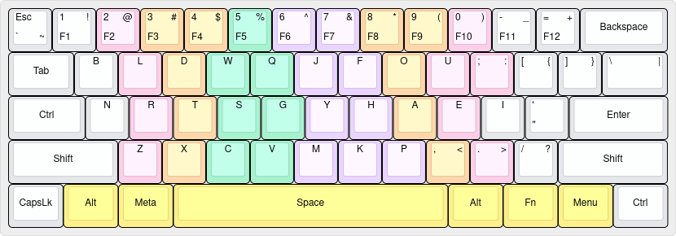

# OmniFlow

It's the keyboard-layout, i am personally daily-driving in my systems.

It's purely inspired from the <a href="https://github.com/DreymaR/Gralmak#gralmak">Gralmak</a> keyboard layout.  
Mine, are just small alterations from it, according to my needs and comforts.

[Here](./docs/motivation.md), is my motivation for the switch.

Here are some references i used, to make my decision:
  - https://github.com/DreymaR/Gralmak/
  - https://altalpha.timvink.nl/
  - https://dreymar.colemak.org/
  - https://getreuer.info/posts/keyboards/alt-layouts/
  - https://getreuer.info/posts/keyboards/symbol-layer/index.html

## Preview

### 60% ANSI Row-Staggered Keyboard

