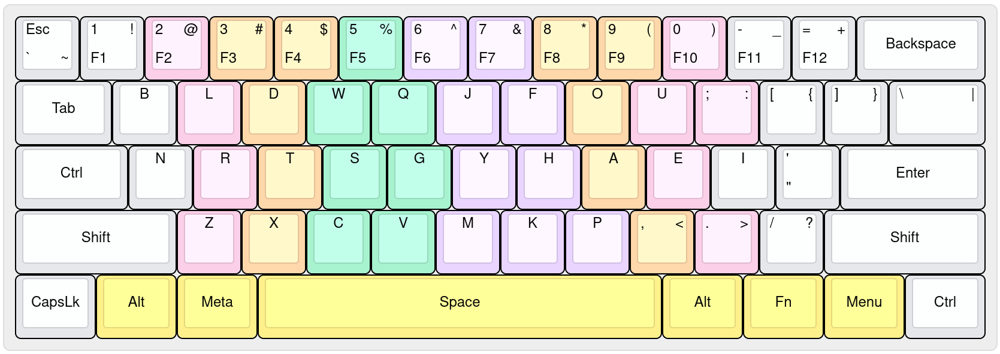

# OmniFlow

It's the keyboard-layout, i am personally daily-driving in my systems.

It's purely inspired from the <a href="https://github.com/DreymaR/Gralmak#gralmak">Gralmak</a> keyboard-layout.  
Mine, are just small alterations from it, according to my needs and comforts.

[Here](./docs/motivation.md), is my motivation for the switch.

**Here are some references i used, to make my decision**:
  - https://github.com/DreymaR/Gralmak/
  - https://altalpha.timvink.nl/
  - https://dreymar.colemak.org/
  - https://getreuer.info/posts/keyboards/alt-layouts/
  - https://getreuer.info/posts/keyboards/symbol-layer/index.html

**What the difference from <a href="https://github.com/DreymaR/Gralmak#gralmak">Gralmak</a> keyboard-layout ?**
  - The bottom-row keys placements. Swapped out the positions of the  
    keys like `Z`, `X`, `M`, `C`, and `V` in a way which is convenient to  
    my hands.
  - Arrangements of symbols like `;` and `'` in way matching the `Colemak-DH`  
    keyboard-layout (since i like it).

## Preview

#### Keyboard-Layout for `60% Row-Staggered ANSI` Keyboard
  

  
Base Layout

  

