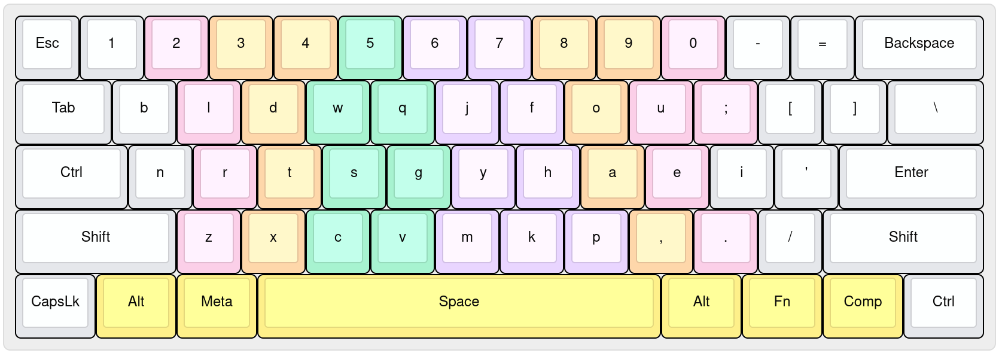
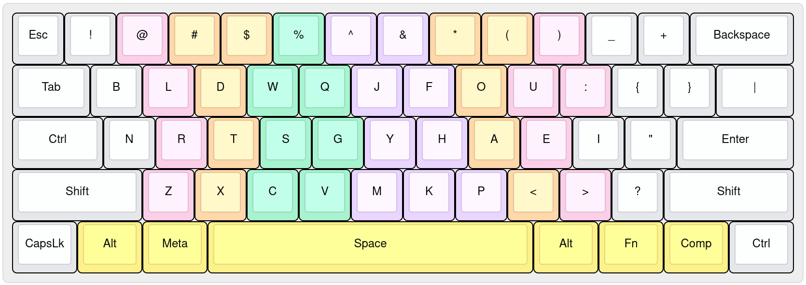
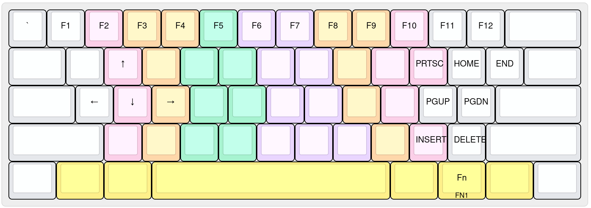
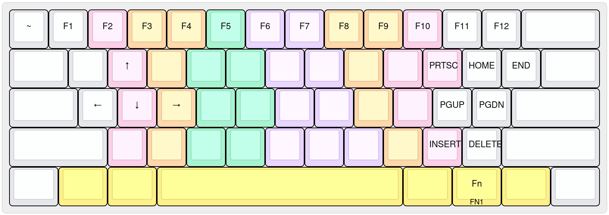
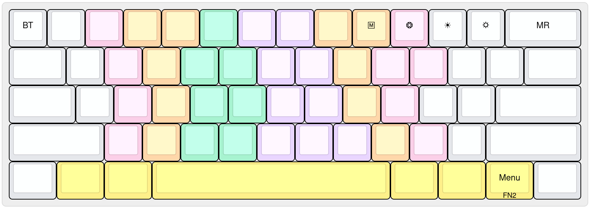

# OmniFlow

It's the keyboard-layout, i am personally daily-driving in my systems.

It's purely inspired from the <a href="https://github.com/DreymaR/Gralmak#gralmak">Gralmak</a> keyboard-layout.
Mine, are just small alterations from it, according to my needs and comforts.

[Here](./docs/motivation.md), is my motivation for the switch.

<blockquote>
  <b>Here are some references i used, to make my decision</b>:
  <ul>
    <li><a href="https://github.com/DreymaR/Gralmak/">https://github.com/DreymaR/Gralmak/</a></li>
    <li><a href="https://altalpha.timvink.nl/">https://altalpha.timvink.nl/</a></li>
    <li><a href="https://dreymar.colemak.org/">https://dreymar.colemak.org/</a></li>
    <li><a href="https://getreuer.info/posts/keyboards/alt-layouts/">https://getreuer.info/posts/keyboards/alt-layouts/</a></li>
    <li><a href="https://getreuer.info/posts/keyboards/symbol-layer/index.html">https://getreuer.info/posts/keyboards/symbol-layer/index.html</a></li>
  </ul>
</blockquote>

<b>What's the difference from <a href="https://github.com/DreymaR/Gralmak#gralmak">Gralmak</a> keyboard-layout ?</b>

<ul>
  <li>
    The bottom-row keys placements. Swapped out the positions of the 
    keys like <code>Z</code>, <code>X</code>, <code>M</code>, <code>C</code>, and <code>V</code> in a way which is convenient to 
    my hands. 
  </li>
  <li>
    Arrangements of symbols like <code>;</code> and <code>'</code> in way matching the <code>Colemak-DH</code> 
    keyboard-layout (since i like it).
  </li>
</ul>

## Preview

### Keyboard-Layout for `60% Row-Staggered ANSI` Keyboard

<blockquote>
  

    
<code>BASE</code> Layer Layout

    
  

  

    
<code>SHIFT</code> Layer Layout

    
  

  

    
<code>FN1</code> Layer Layout

    
  

  

    
<code>FN1</code>+<code>SHIFT</code> Layer Layout

    
  

  

    
<code>FN2</code> Layer Layout

    
  

</blockquote>

## Credits:

<ul>
  <li><a href="https://codeberg.org/kathiravan/">kathiravan</a></li>
  <li><a href="https://codeberg.org/sarguru02/">sargurunathan</a></li>
</ul>
